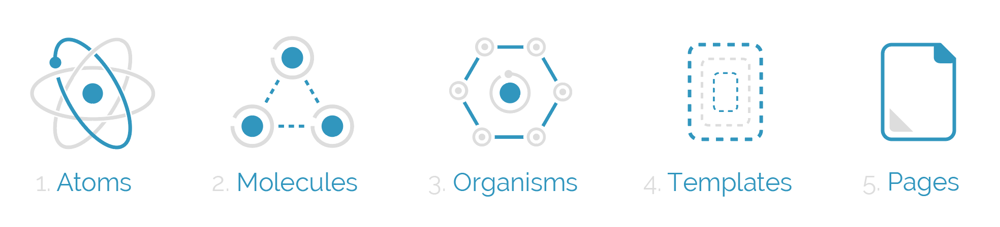

# React Native Typescript Boilerplate
> Maintainer Le Anh Duc<anhdle14@hotmail.com>
---

**Features**
1. React-Native-Dom (RND) & React-Native-Web (RNW)
2. i18next for multi languages + localization
3. Typescript
4. React-Navigation
5. Apollo + GraphQL
6. Formik

## Getting Started
---

### Quick Start

```bash
git clone http://github.com/anhdle14/rn-boilerplate.git
cd rn-boilerplate
npm install -g react-native-cli react-devtools
npm install
npm run native:start # For Packager & Metro Bundler
npm run native:ios # For MacOS, iPhone Simulator
npm run native:android # For Android Simulator
```

## Usage
---

### Writing forms

> Use Formik for forms

- [Formik Docs](https://jaredpalmer.com/formik)

> **Quick Start**

```javascript
// Formik x React Native example + Typescript
import * as React from "react";
import { Button, TextInput, View } from "react-native";
import { Formik } from "formik";

interface IProps {
  handleChange: (value: string) => void;
  handleBlur: (value: string) => void;
  handleSubmit: () => void;
}

export const MyReactNativeForm = (props: IProps) => (
  <Formik
    initialValues={{ email: "" }}
    onSubmit={values => console.log(values)}
  >
    {props => (
      <View>
        <TextInput
          onChangeText={props.handleChange("email")}
          onBlur={props.handleBlur("email")}
          value={props.values.email}
        />
        <Button onPress={props.handleSubmit} title="Submit" />
      </View>
    )}
  </Formik>
);
```

### UI/UX

> Recommend using React Native Paper

- [React Native Paper Docs](https://callstack.github.io/react-native-paper/)

### Icons

> Recommend using react-native-vector-icons

- [Docs](https://oblador.github.io/react-native-vector-icons/)
- [GitHub](https://github.com/oblador/react-native-vector-icons)

### For Getting Data from server

> Using Apollo Client + GraphQL (Update...)

[Apollo Docs](https://www.apollographql.com/docs)
[GraphQL](https://graphql.org/learn)

### Typescript

1. [Learn TypeScript in One Video](https://www.youtube.com/watch?v=-PR_XqW9JJU)

### Folder Structure

#### [Atomic Design](https://github.com/danilowoz/react-atomic-design)



> Popularly known within the design world, Atomic Design helps to build consistent, solid and reusable design systems. Plus, in the world of React, Vue and frameworks that stimulate the componentization, Atomic Design is used unconsciously; but when used in the right way, it becomes a powerful ally for developers.

#### General Guideline about React

> Follow Airbnb guidelines [Here](https://github.com/airbnb/javascript/tree/master/react)

#### Naming Conventions

[The convention](https://hackernoon.com/react-components-naming-convention-%EF%B8%8F-b50303551505)

```md
[Domain]|[Page/Context]|ComponentName|[Type][] is optionals
```

To use with Atomic Design => [Level5][level4]`ComponentName`[Level3]

#### Folder Location

---

```bash
# tree ./src
./src
├── libs
│   ├── components
│   │   ├── atoms # Level 1
│   │   ├── molecules # Level 2
│   │   └── organisms # Level 3
│   │   └── templates # Level 4
│   ├── screens # Level 5
│   └── services # All other libs
│       ├── apollo
│       ├── i18n
│       └── routes
└── resources # Resource Assets
    └── images
```

---

### References

1. [Awesome TypeScript](https://github.com/dzharii/awesome-typescript)
2. [Awesome React, React-native](https://github.com/jondot/awesome-react-native)

## Docs

- [Project Structure](https://medium.freecodecamp.org/how-to-structure-your-project-and-manage-static-resources-in-react-native-6f4cfc947d92)
- [How React-Native on the Web possible?](https://github.com/vincentriemer/react-native-dom)

## Credits

- vincentriemer <vincentriemer@gmail.com> - [react-native-dom](https://github.com/vincentriemer/react-native-dom)
